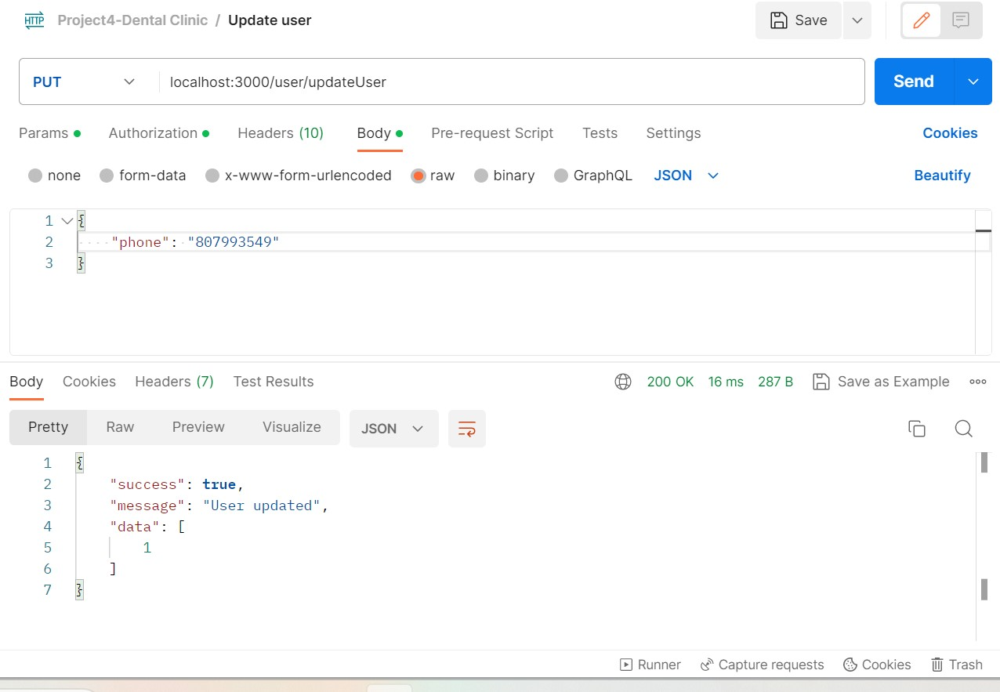
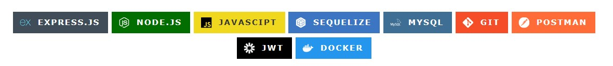

#       Cuarto proyecto - Backend Clínica Dental

Este es el cuarto proyecto de mi entrenamiento como full stack developer. En este proyecto nos piden crear el  backend correspondiente al sistema de gestión de citas para una Clínica Dental. 

Dentro de los requerimientos tenemos la creación del registro y el login como usuario, así como la actualización de datos, creación de citas y una serie de endpoints los cuales citaré más adelante. 

## Proceso:
A continuación enumero los pasos más relevantes para la ejecución del proyecto:
1. Ejecuto Node con el package Json con npm init -y.
2. Creo el archivo index.js en la ruta principal y el .gitignore con /node_modules.
3. Instalo express, nodemon, sequelize, sequelize-cli, mysql2, bcrypt y jsonwebtoken.
4.  Ejecuto Sequelize con sequelize init.
5.  Creo en scripts "dev": "nodemon index.js", para mantener el servidor actualizandose.
6.  Ejecuto npm run dev para levantar el servidor.
7.  Requiero express en index.js, y en la variable de instancia app. 
8. Asigno el número de  puerto a nuestro servidor y uso el método listen para ejecutarlo.
9. Asigno el puerto en docker y lo relaciono en la configuración Json del proyecto y a la base de datos.
10. Creo modelos Role, , User, Service y Appointment.
11. Realizo migraciones con sus respectivas referencias.
12. Creo db.js y route.js en raíz
13.  Creo middlewares para controlar el nivel de acceso a la información o a las funcionalidades de la base de datos según roles.   
14. Creo carpeta controllers y views, en views encontramos los destinos finales.
    
## Diagrama base de datos relacional

## Endpoints

A continuación presento una serie de endpoints requeridos. Las visuales las he obtenido gracias a la interacción de la base de datos y sequelize con Postman:

### Registro usuario-Admin

### Login usuario-Doctor 

### Como Doctor, obtener listado de pacientes registrados

### Crear nueva cita como paciente

### Actualizar datos usuario

### Obtener tus propias citas como paciente

### Link al repositorio
https://github.com/martaop18/Project-4-Dental-Clinic.git

### Tecnologías utilizadas: 

### Agradecimientos

A Dani por su entrega, paciencia y dedicación.

A todos los compañeros que día a día me brindan su apoyo, especialmente a Oriana.
Gracias Ori, llegarás muy lejos✨